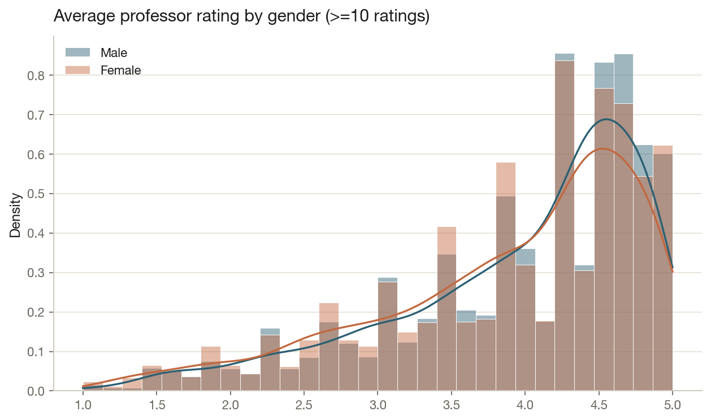
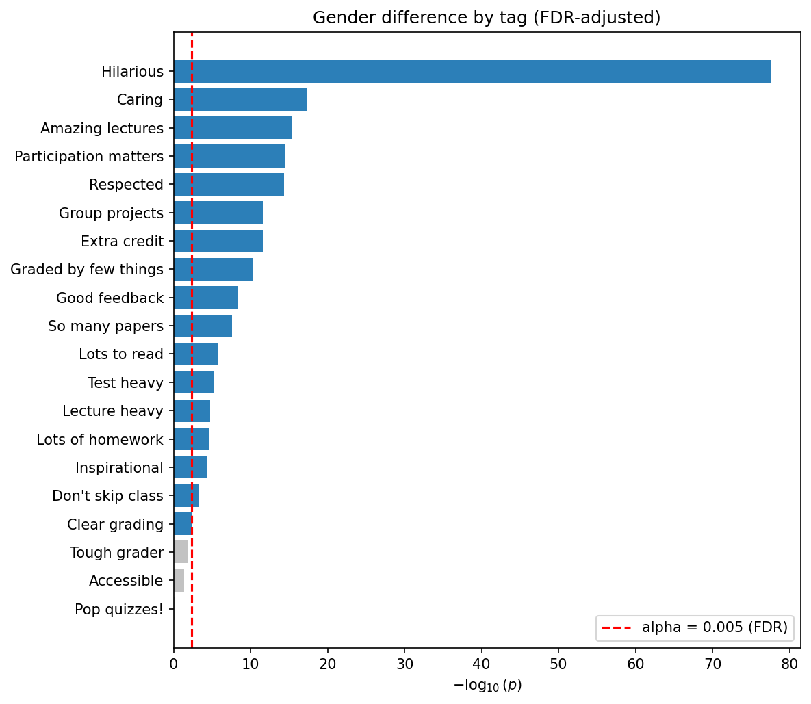
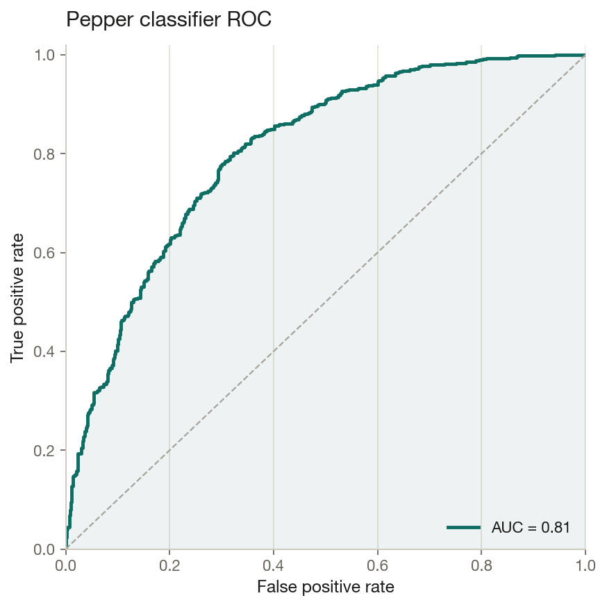
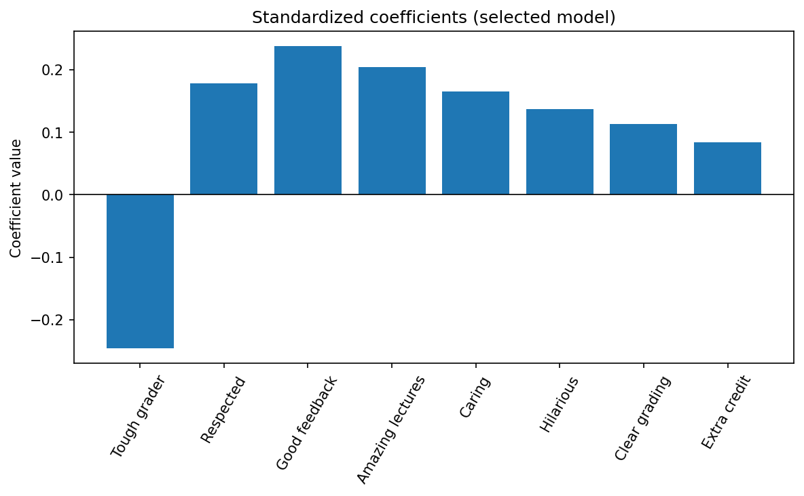

<h1 align="center">Assessing Professor Effectiveness</h1>

<p align="center">
  A reproducible statistical analysis of <b>89,893 RateMyProfessor records</b> — gender bias in
  ratings, gendered teaching tags, and models that predict a professor's rating and "pepper".
</p>

<p align="center">
  <a href="https://github.com/deepanshumody/Analysis_RMP_Ratings/actions/workflows/ci.yml"></a>
  <a href="https://deepanshumody.github.io/Analysis_RMP_Ratings"></a>
  
  
  <a href="LICENSE"></a>
</p>

<p align="center">
  <b><a href="https://deepanshumody.github.io/Analysis_RMP_Ratings">▶ Read the full analysis →</a></b>
</p>

> **Abstract.** Drawing on 89,893 professor records, we find a *small but statistically significant*
> pro-male bias in average ratings (Cohen's *d* ≈ 0.09), no gender difference in perceived difficulty,
> and that 17 of 20 teaching tags are gendered. A from-scratch regression explains 81% of rating
> variance (the strongest signal is "would you take this class again?"), and a calibrated logistic
> model predicts "pepper" status at AUC ≈ 0.81. NYU **DS-GA 1001** capstone (group *CAP 85*),
> packaged as tested, importable code with a reproducible pipeline and a published website.

---

## Key findings

| # | Question | Finding | Evidence |
|---|----------|---------|----------|
| Q1 | Pro-male bias in average rating? | **Yes, but small** | one-sided MWU *p* = 3.7×10⁻⁴; Cohen's *d* = 0.09 |
| Q2 | Difference in rating *spread*? | **Yes** | Levene *p* = 0.0024; women's ratings more dispersed |
| Q3 | How big are the effects? | **Small** | *d* = 0.09 [0.04, 0.13]; variance ratio 0.91 [0.85, 0.98] |
| Q4 | Gendered teaching tags? | **17 of 20** | FDR @ α=0.005; *Hilarious*, *Caring*, *Amazing lectures* most gendered |
| Q5–6 | Difference in difficulty? | **No** | MWU *p* = 0.79; *d* ≈ 0 |
| Q7 | Predict rating (numeric features) | **R² = 0.81** | "would retake" dominates |
| Q8 | Predict rating (tags) | **R² = 0.74** | *Tough grader* strongest (β = −0.25) |
| Q9 | Predict difficulty (tags) | **R² = 0.60** | *Tough grader* strongest (β = +0.40) |
| Q10 | Predict "pepper" | **AUC = 0.81** | pipeline, balanced classes, Youden threshold |
| Q11 | NY vs NJ ratings (bonus) | **No difference** | MWU *p* = 0.06 |

<p align="center">
  
  
</p>
<p align="center">
  
  
</p>

## Methodology highlights

- **Honest evaluation.** All preprocessing (standardization) is fit inside cross-validation on the
  training folds only, via scikit-learn `Pipeline`s — so reported R²/RMSE/AUC are genuine
  out-of-sample estimates. The pepper classifier handles class imbalance with balanced weights and
  selects its threshold by **Youden's J**.
- **Multiple-comparison control.** Across the 20 tag tests we control the false-discovery rate with
  **Benjamini–Hochberg** at α = 0.005.
- **Right test for the question.** Rank-based non-parametric tests (Mann–Whitney, KS, Levene) for
  bounded, skewed ratings; a **one-sided** test where the hypothesis is directional; and **bootstrap
  95% CIs** for every effect size.
- **From-scratch ML.** OLS / ridge / lasso implemented with numpy and **validated against
  scikit-learn** in the test suite.

## Repository structure

```
src/ape/            # the analysis package
  data.py             load + clean (≥10-rating threshold, gender filter, tag normalization)
  stats_tests.py      Mann-Whitney / KS / Levene / chi² + Benjamini-Hochberg FDR
  effects.py          Cohen's d, variance ratio, bootstrap CIs
  regression.py       from-scratch OLS / ridge / lasso (validated vs scikit-learn)
  model_selection.py  k-fold CV + forward selection
  classify.py         'pepper' logistic model + Youden threshold
  viz.py              all plots → return Figure objects (no implicit file writes)
  questions.py        q1()…q11() orchestrators
tests/              # 42 pytest tests
scripts/run_analysis.py   # regenerate every figure + reports/results.json
site/               # Quarto source for the website
app/streamlit_app.py      # optional interactive dashboard
data/raw/           # the three rmpCapstone*.csv files
reports/            # results.json + curated figures
```

## Run it yourself

```bash
git clone https://github.com/deepanshumody/Analysis_RMP_Ratings
cd Analysis_RMP_Ratings
make setup      # create a venv and install the ape package
make test       # 42 tests (from-scratch ML checked against scikit-learn)
make analysis   # regenerate reports/figures/*.png and reports/results.json
```

Optional extras:

```bash
streamlit run app/streamlit_app.py     # interactive dashboard
quarto render site                     # rebuild the website (needs Quarto)
```

## Methods at a glance

- **Reliability threshold:** keep professors with **≥ 10 ratings** (9,841 of 89,893); add a
  high-confidence gender filter for the gender questions (7,105).
- **Significance:** α = **0.005** throughout (Benjamin et al., 2018).
- **Tags:** normalized per number of ratings (one consistent scheme).
- **Reproducibility:** all randomness seeded (`RANDOM_SEED = 10676128`).

## Team & contributions

Group **CAP 85** (NYU DS-GA 1001):

- **Deepanshu Mody** — EDA, preprocessing, **regression (Q7–Q9), classification (Q10)**, and this
  package/site/engineering write-up.
- **Evan Beck** — EDA, preprocessing, hypothesis testing, power analysis.
- **Samarth Agarwal** — EDA, preprocessing, hypothesis testing, power analysis.

The [original group report](https://docs.google.com/document/d/1M5GcozvDQxWaWHERhlZjKv4_HsLnH_WzgyD-icaFvdw/edit)
is available for reference.

## License

[MIT](LICENSE) © 2024 Deepanshu Mody
